# Lexora — Enterprise Legal AI Case Management Platform

[](https://www.python.org/)
[](https://www.djangoproject.com/)
[](https://www.django-rest-framework.org/)
[](https://fastapi.tiangolo.com/)
[](https://docs.celeryq.dev/)
[](https://langchain-ai.github.io/langgraph/)
[](https://www.pinecone.io/)
[](https://cohere.com/)
[](https://groq.com/)
[](./DEPLOY_AWS.md)
[](./LICENSE)

**Lexora** is a full-stack legal workspace for law firms and legal teams: manage cases, upload documents, index them into a vector store, ask a **case-aware RAG assistant** with citations, run **semantic search**, and track hearings — from one product UI.

> Portfolio / Upwork project. Built end-to-end (product UI, APIs, async pipelines, RAG, Docker deploy).

---

## Demo

| Asset | Link |
|-------|------|
| **Walkthrough video** | *[Add your YouTube / Loom / Drive link here]* — local file: [`demo/lexora-demo.mp4`](./demo/lexora-demo.mp4) (not committed; see [`demo/README.md`](./demo/README.md)) |
| **Screenshots** | [`screenshots/`](./screenshots/) |
| **AWS deploy guide** | [`DEPLOY_AWS.md`](./DEPLOY_AWS.md) |

<p align="center">
  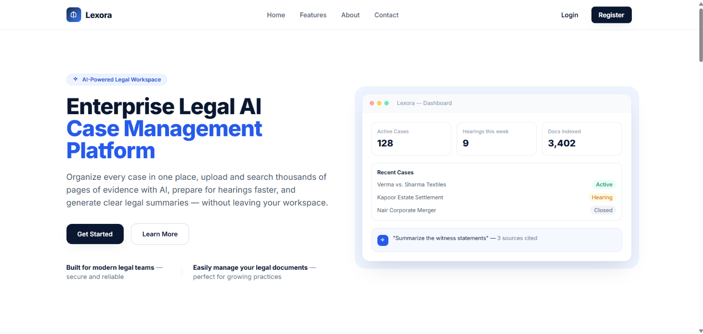
</p>

<p align="center">
  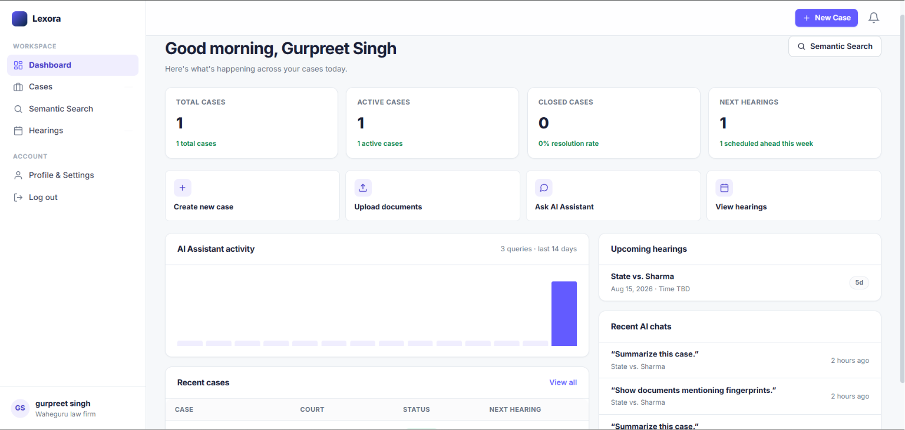
  &nbsp;
  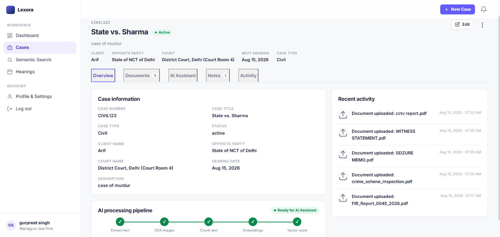
</p>

<p align="center">
  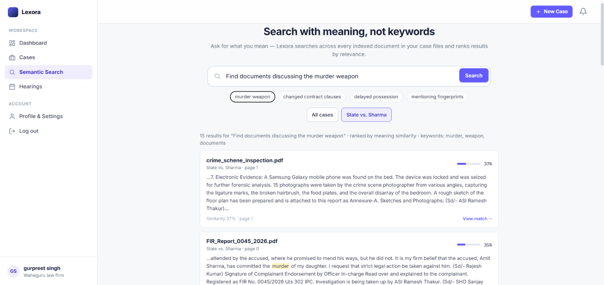
  &nbsp;
  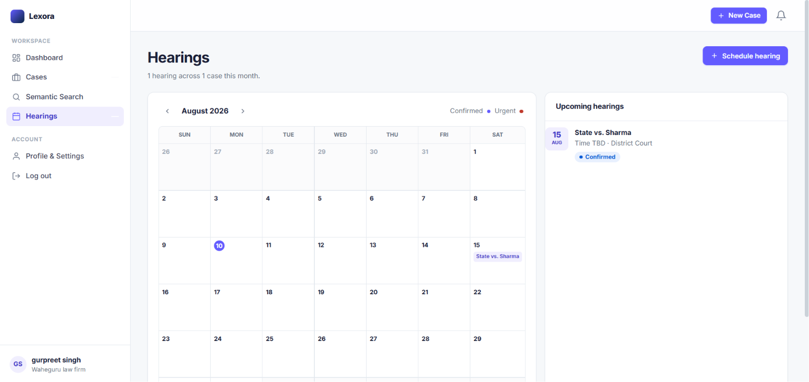
</p>

---

## Table of contents

1. [What I built vs Future](#what-i-built-vs-future)
2. [Features](#features)
3. [Code highlights](#code-highlights)
4. [Architecture](#architecture)
5. [Tech stack](#tech-stack)
6. [Project structure](#project-structure)
7. [Prerequisites](#prerequisites)
8. [Environment variables](#environment-variables)
9. [Setup & run](#setup--run)
10. [How each feature works](#how-each-feature-works)
11. [API reference](#api-reference)
12. [Pages / routes](#pages--routes)
13. [Background jobs](#background-jobs)
14. [Deploy on AWS](#deploy-on-aws-docker)
15. [Troubleshooting](#troubleshooting)
16. [License](#license)

---

## What I built vs Future

Honest scope for recruiters and clients.

### What I built (working)

| Area | Delivered |
|------|-----------|
| **Auth** | Register, login, logout, forgot/reset password (OTP email via Celery). MFA OTP flow is implemented and can be enabled per user in Profile. |
| **Cases** | Create, list, detail, update, delete; hearing date syncs a `Hearing` row. |
| **Documents** | Upload → Celery chunk/embed → Pinecone; delete cleans vectors + file + DB. |
| **AI Assistant** | Real RAG chat on a case (FastAPI + LangGraph + Groq) after docs are indexed. |
| **Semantic search** | Meaning search across indexed docs with scores, snippets, and case/PDF links. |
| **Hearings** | Calendar/list UI + CRUD APIs. |
| **Dashboard** | Live KPIs, upcoming hearings, recent AI chats / activity. |
| **Notes & activity** | Case notes CRUD; activity feed derived from case/docs/notes/hearings. |
| **Analytics** | Event tracking + optional daily digest email (Celery Beat). |
| **Ops** | Docker Compose (nginx, Django, FastAPI, Celery, Redis, Postgres) + AWS EC2 guide. |

### Future / not claimed as live

| Item | Status |
|------|--------|
| In-app notification bell | UI shell only (“Coming in the next version…”) |
| Google / GitHub OAuth | Env keys may exist; **no OAuth code paths** |
| Gemini | Env key unused |
| Email verification gate | Flow exists but **off by default** (`EMAIL_VERIFICATION_ENABLED = False`) — accounts auto-verify on signup |
| Case “Export case file” menu item | Placeholder link (not a real export pipeline) |
| Overview pipeline checkmarks | Visual indicator of the AI pipeline; live indexing status is on the Documents tab / Celery jobs |

> Demo video and screenshots show the **working** product surface. AI Assistant and Semantic Search require Celery + Cohere / Groq / Pinecone keys.

---

## Features

| Feature | Screenshot | What it does |
|---------|------------|--------------|
| **Landing** |  | Product homepage, features, CTA to register/login |
| **Dashboard** |  | KPIs, quick actions, upcoming hearings, recent AI activity |
| **Case workspace** |  | Overview, documents, **AI Assistant**, notes, activity |
| **Semantic search** |  | Cross-case (or scoped) vector search with highlighted passages |
| **Hearings** |  | Schedule and track court dates |
| **Profile & security** | 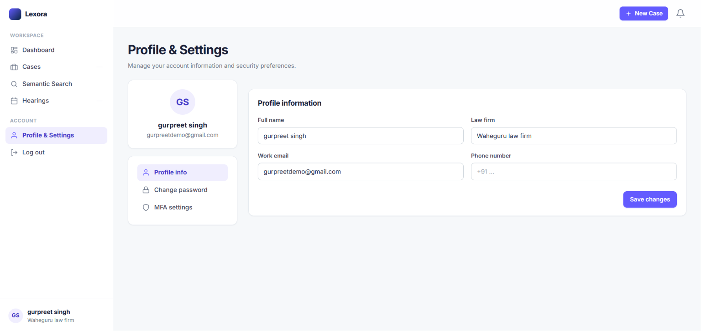 | Profile fields, password change, MFA toggle |

**GIF tip for Upwork:** record short loops (upload → indexed, ask AI → answer with citations, search → results) and drop them next to these rows if you export GIFs later. Screenshots above are enough for GitHub.

---

## Code highlights

Clean backend design — OOP class views, pipelines, and services (not logic dumped in templates).

### Auth API — template-method base class

`BaseAuthApiView` validates the request with a schema, delegates work to `handle()`, and always returns a consistent success/error envelope. Every auth endpoint reuses this pattern.

<p align="center">
  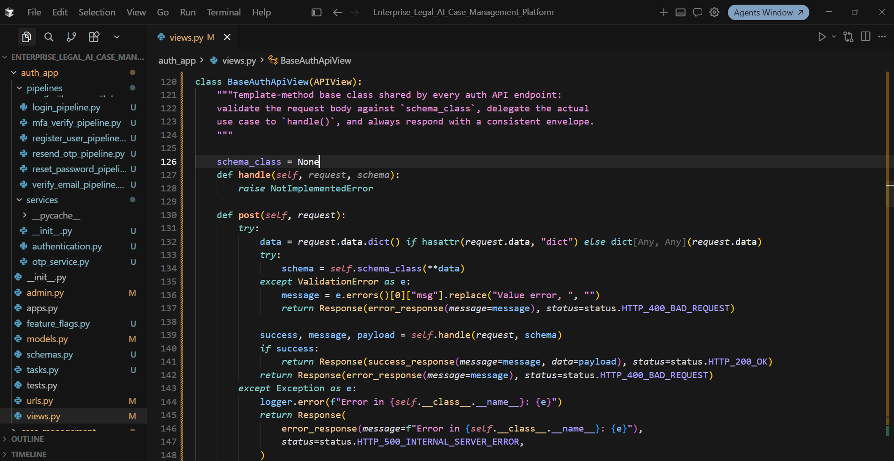
</p>

### Dashboard API — pipeline + service layer

`DashboardApi` stays thin: authenticate → run `DashboardOverviewPipeline` → serialize KPIs, cases, hearings, and AI activity. Business logic lives in `pipeline/` and `services/`.

<p align="center">
  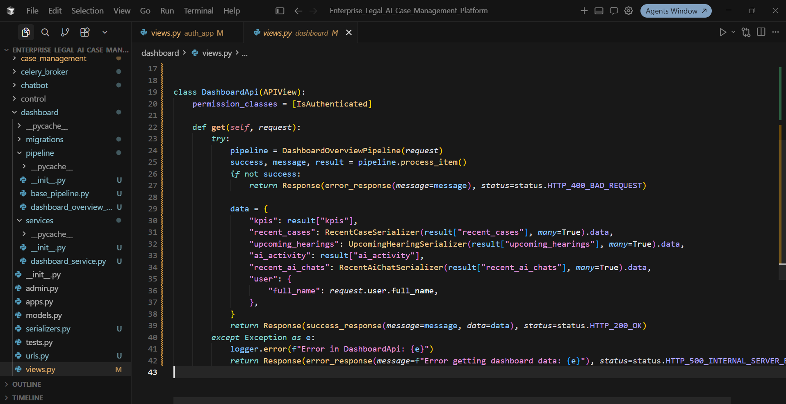
</p>

| Screenshot | File | What it shows |
|------------|------|----------------|
| `code-auth-oop-base.png` | `auth_app/views.py` | OOP inheritance + template method for all auth APIs |
| `code-dashboard-pipeline.png` | `dashboard/views.py` | Pipeline/service separation for dashboard data |

---

## Architecture

Simple Lucidchart-style flows (top → bottom).

### 1) How the whole app connects

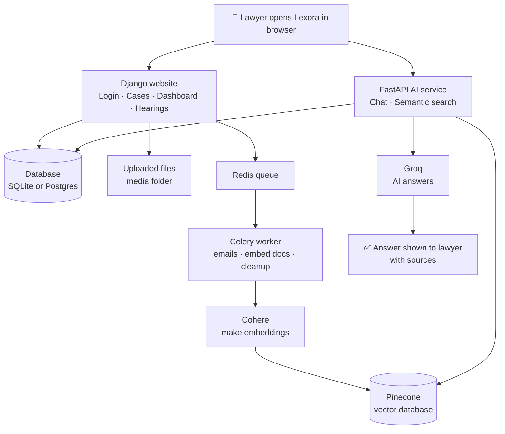

### 2) Upload a document → ready for AI

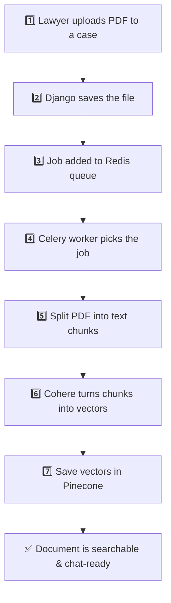

### 3) Ask the AI Assistant (RAG)

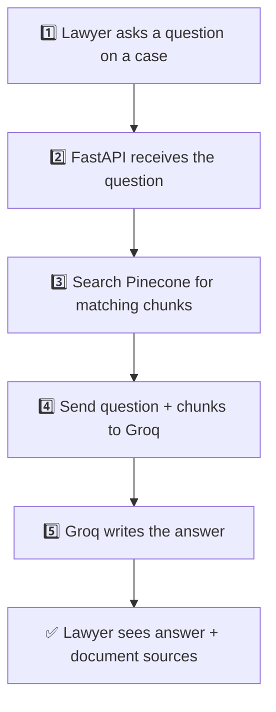

### 4) Semantic search

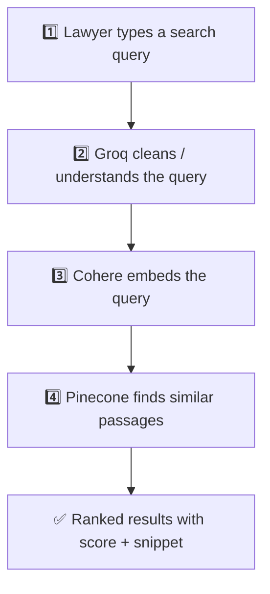

| What | Where it lives |
|------|----------------|
| Users, cases, chats | Database (SQLite local / Postgres in Docker) |
| PDF files | `media/` folder |
| Document meaning (vectors) | Pinecone |
| Make vectors | Cohere |
| Write answers | Groq |
| Background jobs | Celery + Redis |

---

## Tech stack

| Layer | Technology |
|-------|------------|
| Web | Django 5.2, Django REST Framework |
| Chat / search API | FastAPI + Uvicorn |
| Async jobs | Celery + django-celery-results |
| Broker | Redis (Memurai OK on Windows) |
| RAG | LangGraph + LangChain |
| LLM | Groq |
| Embeddings | Cohere |
| Vector DB | Pinecone |
| Validation | Pydantic |
| App UI | Custom CSS + vanilla JS |
| Landing | Tailwind CDN + Alpine.js CDN |
| Deploy | Docker Compose, nginx, Gunicorn, Postgres |

---

## Project structure

```
Enterprise_Legal_AI_Case_Management_Platform/
├── auth_app/                 # User model, auth pipelines, OTP, profile
├── case_management/          # Cases, documents, notes, hearings
├── chatbot/                  # Embeddings, RAG, search + FastAPI app
├── dashboard/                # Dashboard page + overview API
├── analytics/                # Events + digest email
├── static/                   # CSS + JS
├── templates/                # Django templates
├── screenshots/              # Portfolio screenshots (committed)
├── demo/                     # Demo video locally (MP4 gitignored)
├── docker/ + nginx/          # Container entrypoint + reverse proxy
├── docker-compose.yml
├── Dockerfile
├── DEPLOY_AWS.md
├── start_services.ps1        # Local Windows: Django, Celery, beat, FastAPI
└── manage.py
```

---

## Prerequisites

1. **Python 3.11+**
2. **Redis** (or Memurai on Windows) at `REDIS_URL`
3. API keys for AI: **Cohere**, **Groq**, **Pinecone**
4. SMTP for OTP / reset / digest emails (Gmail app password recommended)
5. Optional: **Docker Desktop** for Compose / AWS-style local run

---

## Environment variables

Copy [`.env.example`](./.env.example) → `.env`. **Never commit real secrets.**

| Variable | Required | Purpose |
|----------|----------|---------|
| `REDIS_URL` | Yes (local) | e.g. `redis://localhost:6379/0` |
| `CHATBOT_API_BASE_URL` | Yes | Local: `http://127.0.0.1:8001` · Docker/nginx: `/ai` |
| `COHERE_API_KEY` | For AI | Embeddings |
| `GROQ_API_KEY` | For AI | Chat + query analysis |
| `pinecone_Api_key` | For AI | Note exact casing |
| `PINECONE_INDEX_NAME` | For AI | e.g. `documents` |
| `PINECONE_CLOUD` / `PINECONE_REGION` | For AI | e.g. `aws` / `us-east-1` |
| `EMAIL_HOST_USER` / `EMAIL_HOST_PASSWORD` | For email | SMTP |
| `DEFAULT_FROM_EMAIL` | Recommended | From address |
| `ANALYTICS_DIGEST_ENABLED` / `ANALYTICS_DIGEST_EMAIL` | Optional | Daily digest |
| `POSTGRES_*` | Docker only | Set when `POSTGRES_HOST` is present |

Unused today (safe to omit): `GEMINI_API_KEY`, Google/GitHub OAuth keys.

---

## Setup & run

### 1. Clone and virtualenv

```powershell
cd <project-root>
python -m venv .venv
.\.venv\Scripts\Activate.ps1
pip install -r requirements.txt
```

### 2. Configure `.env`

```powershell
copy .env.example .env
# Edit .env with your keys
```

### 3. Database

```powershell
python manage.py migrate
python manage.py createsuperuser   # optional → /admin/
```

### 4. Start Redis

Ensure Redis/Memurai is listening on `REDIS_URL`.

### 5. Start all services

**Option A — Windows helper**

```powershell
.\start_services.ps1
```

Opens four terminals: Django `:8000`, Celery worker, Celery beat, FastAPI `:8001`.

**Option B — manual**

```powershell
python manage.py runserver 127.0.0.1:8000
python -m celery -A Enterprise_Legal_AI_Case_Management_Platform worker -l info --pool=solo
python -m celery -A Enterprise_Legal_AI_Case_Management_Platform beat -l info
python -m uvicorn chatbot.fastapi_app.main:app --host 127.0.0.1 --port 8001 --reload
```

**Option C — Docker Compose**

```powershell
docker compose up --build
```

Then open the nginx-published URL (see `DEPLOY_AWS.md`).

### 6. Open the app

- Landing: http://127.0.0.1:8000/
- Login: http://127.0.0.1:8000/login/
- FastAPI health: http://127.0.0.1:8001/health

---

## How each feature works

### Authentication

1. **Register** creates a user (email as username).
2. With email verification **off** (default), the account is usable immediately.
3. **Login** may require MFA OTP if globally enabled or if the user toggled MFA in Profile.
4. **Forgot / reset password** emails an OTP via Celery.

Toggles: `auth_app/feature_flags.py`.

### Cases

Pipelines handle create / list / update / delete. Case detail loads documents, notes, activity, and the AI chat UI. Changing `hearing_date` syncs a linked `Hearing`.

### Documents & indexing

1. Upload → file in `media/` → Celery `process_document_embedding`.
2. Worker: load → chunk → Cohere → Pinecone (case/document metadata).
3. Delete queues vector + disk + DB cleanup.

**Without the Celery worker**, files save but search/chat have nothing to retrieve.

### Case AI assistant

Browser → FastAPI `POST /api/chat/{case_id}/messages/` (Django session). LangGraph retrieves case chunks from Pinecone; Groq generates the answer. Messages persist for the dashboard.

### Semantic search

`POST /api/search/` → Groq query analysis → Cohere embed → Pinecone → ranked snippets (modal can open PDF page / case).

### Dashboard / hearings / notes / analytics

Live aggregates on `/dashboard-api/`. Hearings have a dedicated calendar page. Notes are first-class CRUD. Analytics events can feed a daily digest email.

---

## API reference

Session auth. FastAPI expects the Django session cookie (and CSRF where configured).

### Auth (Django)

| Method | Path | Purpose |
|--------|------|---------|
| POST | `/register/api/` | Register |
| POST | `/login/api/` | Login |
| POST | `/mfa/api/` | Verify MFA OTP |
| POST | `/forgot-password/api/` | Start reset |
| POST | `/reset-password/api/` | Finish reset |
| GET/PATCH | `/profile/api/` | Profile |
| POST | `/profile/password/api/` | Change password |
| POST | `/profile/mfa/api/` | Toggle MFA |

### Cases / documents / notes / hearings

| Method | Path | Purpose |
|--------|------|---------|
| GET | `/cases-list-api/` | List cases |
| POST | `/cases-create-api/` | Create case |
| GET/PATCH/DELETE | `/cases/<id>/api/` | Detail / update / delete |
| GET/POST | `/cases/<id>/documents-api/` | List / upload |
| DELETE | `/cases/<id>/documents-api/<doc_id>/` | Delete document |
| GET/POST | `/cases/<id>/notes-api/` | Notes |
| GET | `/cases/<id>/activity-api/` | Activity |
| GET/POST | `/hearings-api/` | Hearings |
| PATCH/DELETE | `/hearings-api/<hearing_id>/` | Update / delete hearing |

### Dashboard / analytics / chatbot

| Method | Path | Purpose |
|--------|------|---------|
| GET | `/dashboard-api/` | Dashboard payload |
| POST | `/api/analytics/events/` | Track event |
| GET | `/health` (FastAPI) | Health |
| POST | `/api/search/` | Semantic search |
| GET/POST | `/api/chat/{case_id}/messages/` | Case chat |

---

## Pages / routes

| Path | Page |
|------|------|
| `/` | Landing |
| `/register/`, `/login/`, `/logout/` | Auth |
| `/dashboard/` | Dashboard |
| `/cases/`, `/cases/<id>/` | Cases |
| `/search/` | Semantic search |
| `/hearings/` | Hearings |
| `/profile/` | Profile |
| `/admin/` | Django admin |

---

## Background jobs

| Task | When |
|------|------|
| OTP / password-reset emails | Auth flows |
| Document embedding | After upload |
| Document delete cleanup | After delete |
| Analytics digest | Celery Beat ~02:00 UTC (or `manage.py send_analytics_digest`) |

---

## Deploy on AWS (Docker)

Step-by-step EC2 + Docker Compose: **[DEPLOY_AWS.md](./DEPLOY_AWS.md)**

Stack: nginx → Django/Gunicorn + FastAPI (`/ai`) + Celery + Redis + Postgres.

---

## Windows long-path note

Deep OneDrive paths can break some LangChain imports under Windows `MAX_PATH`. Workaround:

```powershell
subst L: "<full-project-path>"
cd L:\
```

Or enable long paths (admin) and reboot. Prefer `python -m celery` / `python -m uvicorn`.

---

## Troubleshooting

| Symptom | Fix |
|---------|-----|
| Redis errors on start | Start Redis/Memurai; check `REDIS_URL` |
| Upload OK, search/chat empty | Start Celery worker; verify Cohere/Pinecone keys |
| Chat/search 401 / CSRF | Same browser session; confirm FastAPI auth |
| Connection refused `:8001` | Start uvicorn |
| Emails never arrive | Check `EMAIL_*` + worker logs |
| Path too long / `WinError` | Use `subst L:` or enable long paths |

```powershell
python manage.py send_analytics_digest --hours 24
```

---

## License

MIT — see [`LICENSE`](./LICENSE).

Built as an enterprise-style portfolio product (**Lexora**). Use your own API keys and SMTP; never commit `.env`.
